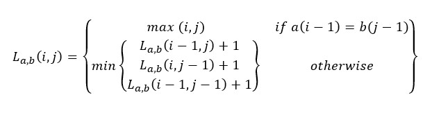

# Advanced Algorithms Assignment 3

Assignment 3 submission work for CS 6045/W01 - Advanced Algorithms.  

## Team Members  
- Michael Hayes (mhayes64@students.kennesaw.edu)
- Cody Bijeaux (cbijeaux@students.kennesaw.edu)
- Amrutvyasa Ramasamy (aramasam@students.kennesaw.edu)

## Run Program

Ensure Python 3.12 or higher is installed.  

Open a terminal window and change directories to this project. `main.py` is the main Levenshtein script. Enter the following command:  
`python .\main.py`  

Input file under the `InputsOutputs` folder will be used to find the Levenshtein differences.  
Output for the inputs will be displayed in the console, and also saved to the `InputsOutputs` folder as `Output.txt`.

To run the test cases, run the following command:
`python .\tests.py`

## Bellman Equation  

The following image shows the Bellman Equation for this algorithm based on the completed code:  
